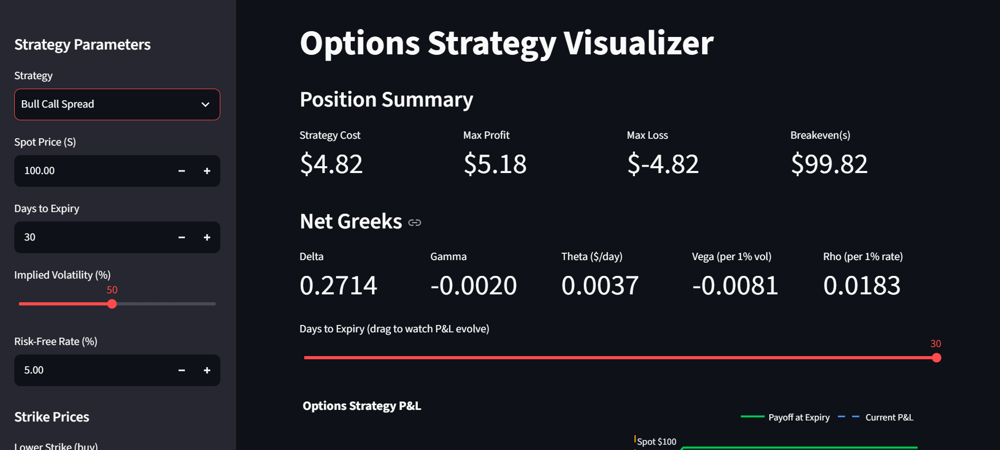
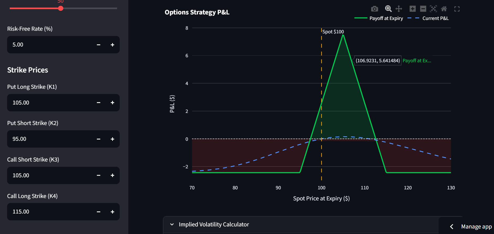
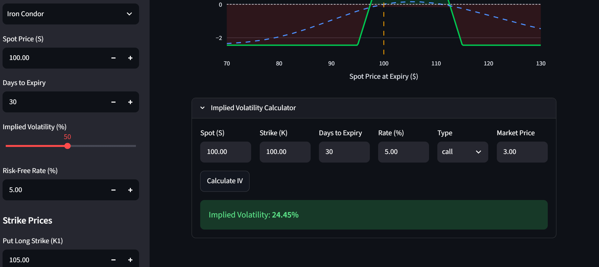

# Options Strategy Visualizer

**[🔴 Live Demo](https://options-strategy-visualizer-fx2ifcqidgrasm7mi8wzf5.streamlit.app/)** · Built with Python, Streamlit, and Docker

An interactive, containerized web application for analyzing options trading strategies. Select a strategy, enter market parameters, and instantly see Black-Scholes pricing, all five Greeks, a payoff diagram at expiry, and a live P&L curve that morphs as time decays — all with no external API dependencies.



## Features

- **7 strategies** — Long Call, Long Put, Covered Call, Bull Call Spread, Bear Put Spread, Long Straddle, Iron Condor
- **Black-Scholes pricing** with closed-form Greeks: delta, gamma, theta, vega, rho
- **Dual P&L visualization** — payoff at expiry (solid) vs. current mark-to-model P&L (dashed), with profit/loss regions shaded
- **Time-decay simulation** — drag the days-to-expiry slider and watch theta erode the position in real time
- **Implied volatility solver** — Newton-Raphson iteration recovers IV from any market price
- **Strategy metrics** — max profit, max loss, and breakevens computed automatically



## Quick Start

### Run with Docker (recommended)

```bash
docker compose up --build
```

Then open https://options-strategy-visualizer-fx2ifcqidgrasm7mi8wzf5.streamlit.app/

### Run locally with Python

```bash
pip install -r requirements.txt
streamlit run app.py
```

## Architecture

The math is fully decoupled from the UI — each module is independently testable:

| Module | Responsibility |
|---|---|
| `pricing.py` | Black-Scholes pricing and analytical Greeks (pure functions, no UI imports) |
| `strategies.py` | Multi-leg strategy construction, payoff-at-expiry and current P&L computation |
| `iv_solver.py` | Implied volatility via Newton-Raphson (vega as derivative, 1e-6 tolerance) |
| `app.py` | Streamlit UI — layout, inputs, Plotly charts; calls the modules above |

## Testing

18 automated tests validate the mathematics:

```bash
pytest tests/ -v
```

Coverage includes Hull's textbook pricing benchmarks, put-call parity (a no-arbitrage invariant), Greeks sign correctness, strategy max-profit/max-loss formulas, IV solver round-trips, and edge cases (T=0, σ=0).



## Model Assumptions

Black-Scholes assumes European exercise, no dividends, constant volatility, and constant rates. Real markets violate these (volatility smiles, early exercise on American options), so outputs are theoretical fair values — not market prices.

## Docker

Multi-stage build: dependencies compile in a builder stage; the runtime stage carries only the venv and application code. Final image runs as a non-root user with a healthcheck against Streamlit's health endpoint. 

## Future Work

- American options via binomial tree
- Dividend yield support
- Historical volatility estimation from price data
- FastAPI endpoint exposing the pricing engine as a REST service

## Tech Stack

Python · Streamlit · NumPy · SciPy · Plotly · Pytest · Docker
